# Habitat-sim环境搭建及基础实践

## 环境搭建

### 创建conda环境

```bash
conda create -n habitat python=3.9 cmake=3.14.0
conda activate habitat
```

1）在自己的电脑上运行或者服务器在自己身边，有显示器的情况，推荐安装带有物理模拟的habitat-sim

```bash
conda install habitat-sim=0.2.5 withbullet -c conda-forge -c aihabitat
```

2）在自己的电脑上运行或者服务器在自己身边，有显示器的情况，也可以安装不带物理模拟的habitat-sim

```bash
conda install habitat-sim=0.2.5 -c conda-forge -c aihabitat
```

3）在租的服务器上，没有显示器的电脑上运行时，使用headless的habitat-sim（带有物理模拟的安装）

```bash
conda install habitat-sim=0.2.5 withbullet headless -c conda-forge -c aihabitat
```

4）在租的服务器上，没有显示器的电脑上运行时，使用headless的habitat-sim（没有物理模拟的安装）

```bash
conda install habitat-sim=0.2.5 -c conda-forge -c aihabitat
```

### 下载 3D 测试场景和示例对象

下载 3D 测试场景

```bash
python -m habitat_sim.utils.datasets_download --uids habitat_test_scenes --data-path data/
```

下载示例对象

```bash
python -m habitat_sim.utils.datasets_download --uids habitat_example_objects --data-path data/
```

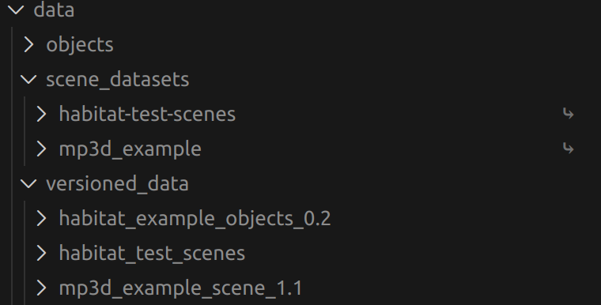

Habitat 的下载脚本 (datasets_download) 采用了“数据版本管理”的设计模式。注意看下载的数据，脚本做了两件事：

存储真实数据：它把真实的文件（模型、贴图等）下载到了 data/versioned_data/中。这样做是为了支持版本控制（比如以后出了新的版本，可以并存）。

创建快捷方式（软链接）：为了方便使用，在 data/下创建了软链接，直接指向上面那个真实目录。

### 进行测试

```bash
habitat-viewer data/scene_datasets/habitat-test-scenes/skokloster-castle.glb
```

出现报错：


运行 habitat-sim 并不一定需要 imageio-ffmpeg 依赖项，该软件包依赖于 libva ，而 libva 又依赖于 libgl 、 libglx 、 libegl 和 libglvnd ，最后这 4 个软件包可能与 Linux 软件包冲突，导致 OpenGL 前端库无法与 OpenGL 后端通信，只要卸载conda环境中这四个包就好了。参考链接：https://github.com/facebookresearch/habitat-sim/pull/2519

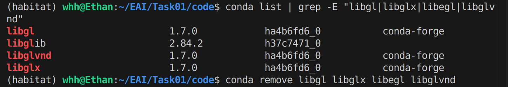
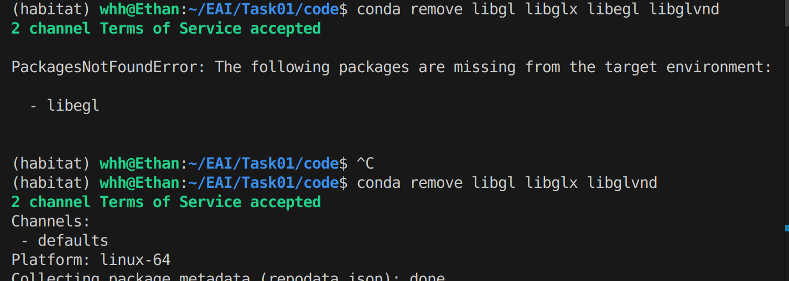

卸载后再次测试：

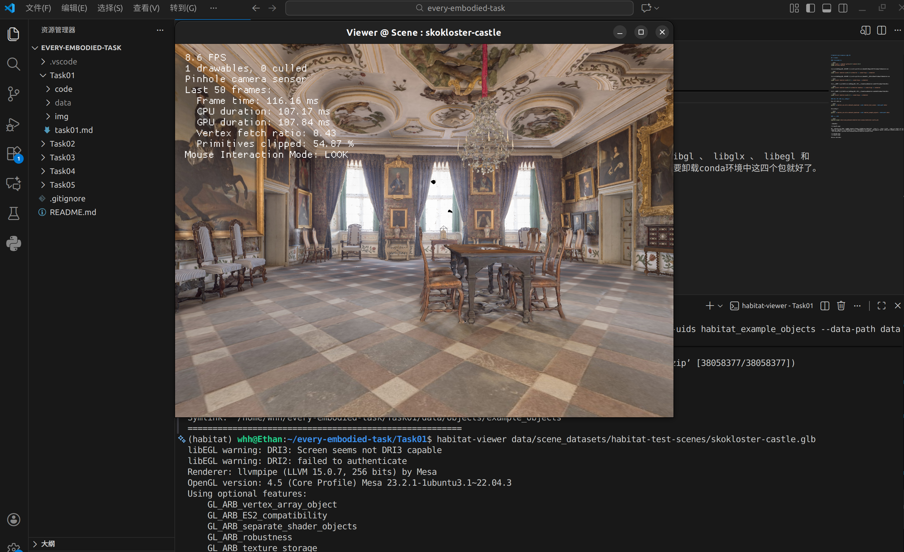

测试成功！

## 基础实践

### 下载MP3D的示例场景数据

```bash
conda activate habitat
python -m habitat_sim.utils.datasets_download --uids mp3d_example_scene --data-path data/
```

### Habitat-sim基础功能测试

运行habitat_test.py文件,这里先进入到code目录下：

```bash
python habitat_test.py
```

测试结果如下：

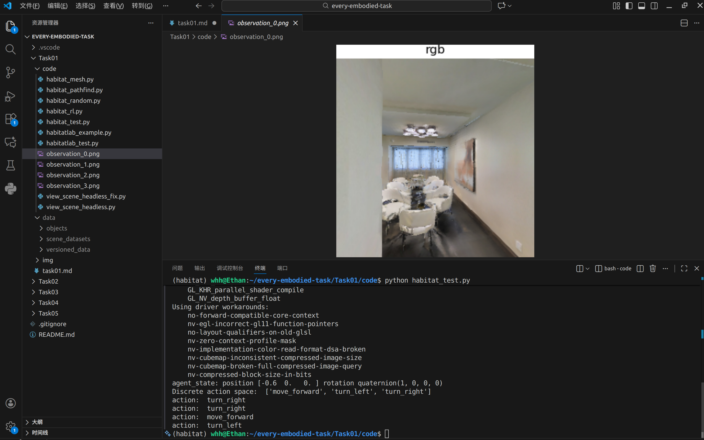

所有结果：


### Habitat-sim进阶配置

运行habitat_random.py

```bash
python habitat_random.py
```

运行完这个文件后，得到如下的结果：

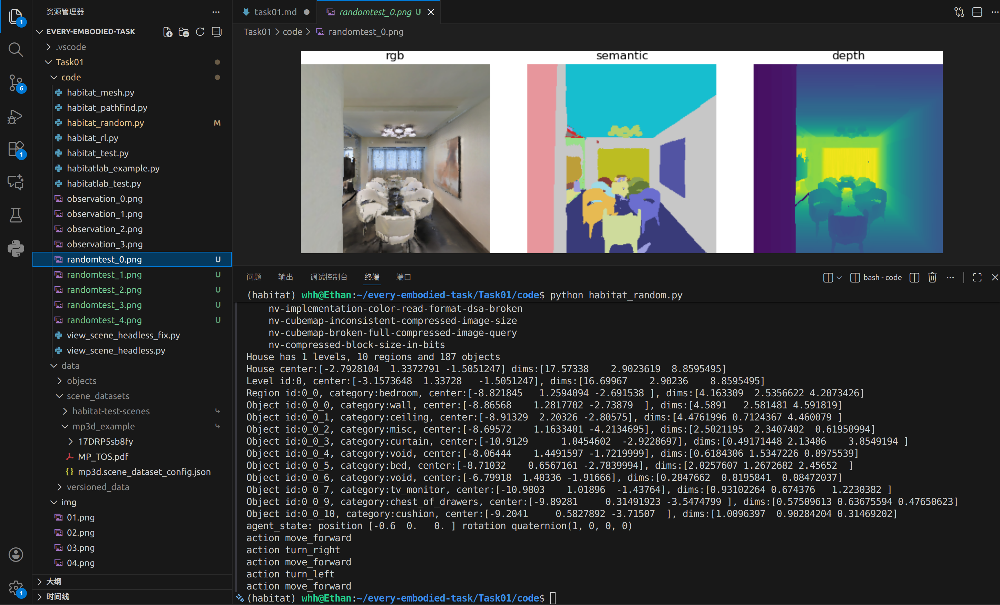

所有结果：


### Habitat-sim的NavMesh

运行habitat_mesh.py 

```bash
python habitat_mesh.py 
```

最终得到的mesh图结果如下所示：

使用sim.pathfinder.get_topdown_view生成的俯视图：

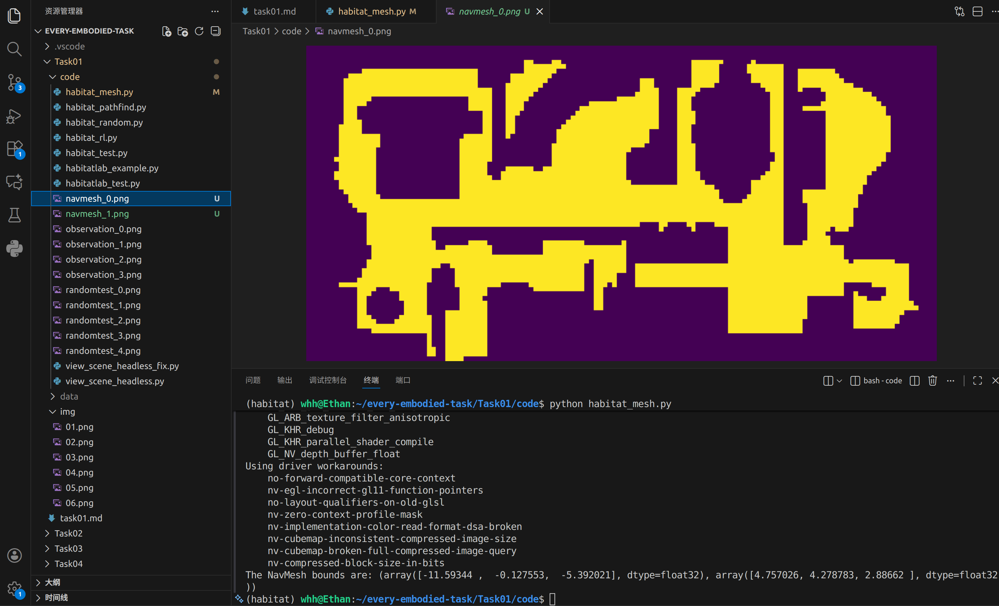


使用get_topdown_map生成的俯视图：

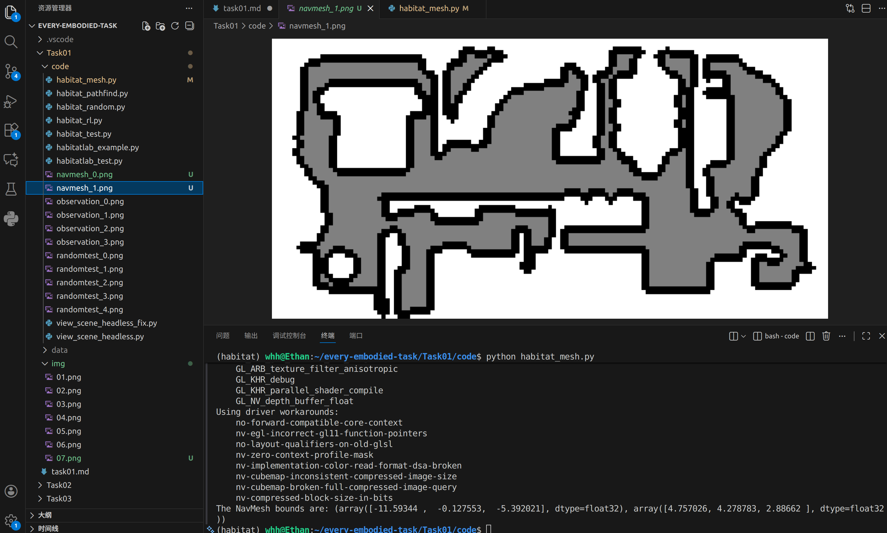


### habitat_pathfind.py详解

运行habitat_pathfind.py

```bash
python habitat_pathfind.py
```

俯视图如下：

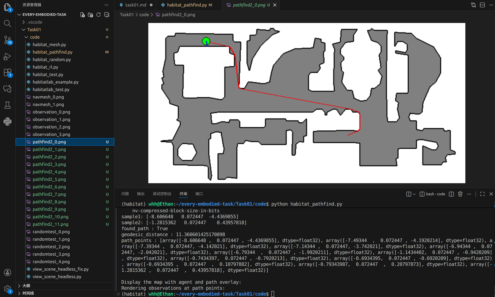

机器人第一视角运行视图如下：

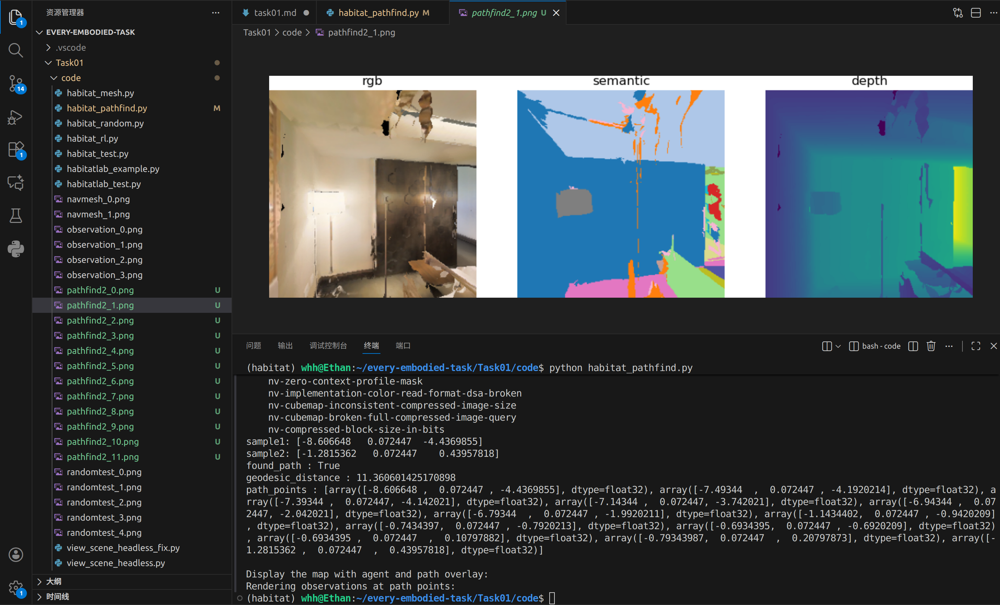

所有结果：


# Habitat-lab环境搭建及基础实践

## 环境搭建

### conda环境配置

这里可以直接使用habitat-sim创建的conda环境,在下载habitat-lab的时候注意需要与安装的habitat-sim版本一致。

```bash
git clone --branch v0.2.5 https://github.com/facebookresearch/habitat-lab.git
cd habitat-lab
pip install -e habitat-lab
```

同时安装habitat-baselines

```bash
pip install -e habitat-baselines
```

安装完 habitat-baselines 时，pip 的依赖解析器把 numpy 自动升级到了 2.0.2，这导致了与 habitat-sim 和 numpy-quaternion 的严重冲突。

>habitat-sim 0.2.5 requires numpy<1.24.0,>=1.20.0, but you have numpy 2.0.2 which is incompatible.

手动降级：

```bash
pip install "numpy<1.24.0"
```

降级后出现新的错误：

>moviepy 2.2.1 requires numpy>=1.25.0, but you have numpy 1.23.5 which is incompatible.

降级 moviepy 到 1.0.3 (这是一个稳定且支持旧 numpy 的版本)

```bash
pip install moviepy==1.0.3
```

### 下载3D场景数据和点导航数据

```bash
python -m habitat_sim.utils.datasets_download --uids habitat_test_scenes --data-path data/
```

```bash
python -m habitat_sim.utils.datasets_download --uids habitat_test_pointnav_dataset --data-path data/
```

场景数据在 habitat-sim 部分已经下载过了，下载点导航数据即可。

## 基础实践

### 交互式导航：

```bash
python code/habitatlab_test.py 
```

运行结果：

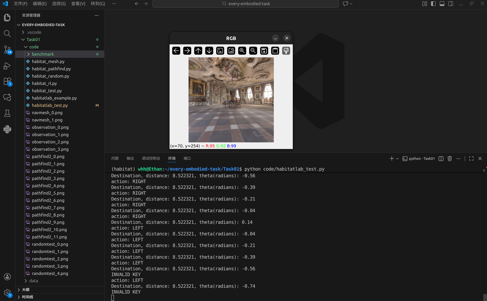

可以通过W、A、S、D进行控制。

### 全自动导航

```bash
python code/habitatlab_example.py 
```

运行结果：

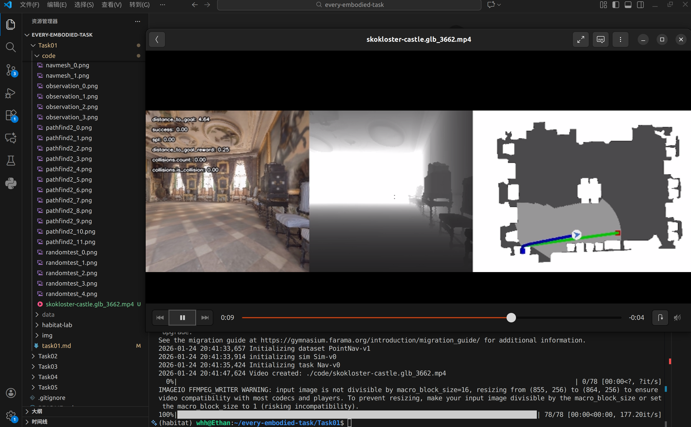

### RLEnv框架的全自动导航

```bash
python code/habitat_rl.py
```

运行结果：

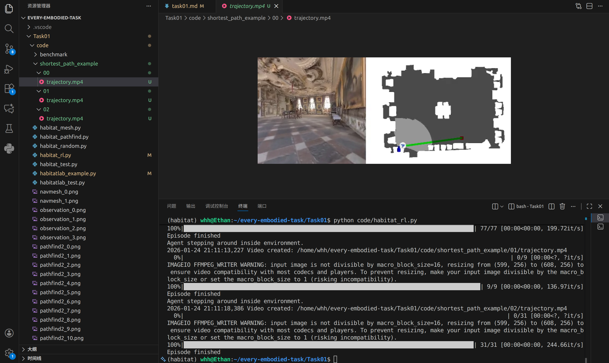

完整视频：  
<video src="code/skokloster-castle.glb_3662.mp4" autoplay="true" controls="controls" width="800" height="250">
</video>

