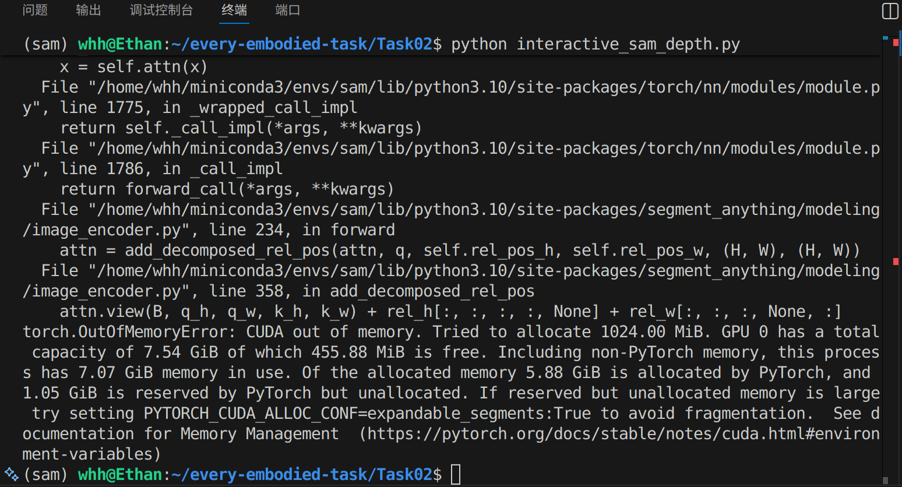
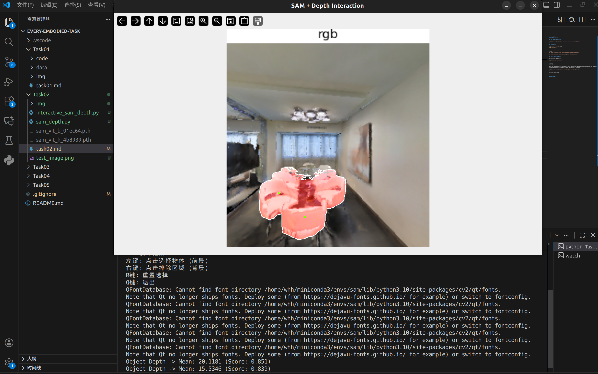
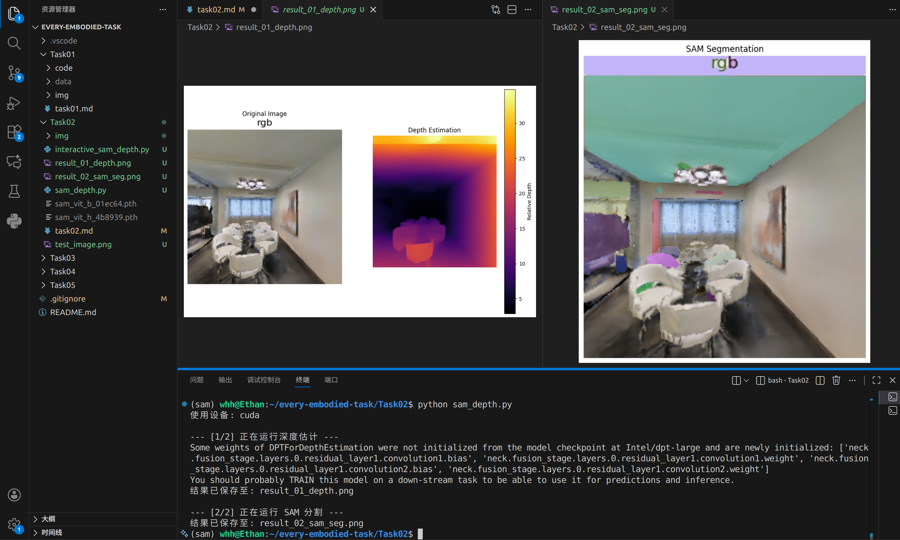

# SAM 分割与深度估计

## 下载 SAM 模型权重 (ViT-H)

```bash
wget 'https://dl.fbaipublicfiles.com/segment_anything/sam_vit_h_4b8939.pth'
```

## 创建conda环境

```bash
conda create -n sam python=3.10
conda activate sam
```

## 安装 Python 依赖

```bash
pip install git+https://github.com/facebookresearch/segment-anything.git

pip install transformers opencv-python matplotlib torch torchvision
```

## 交互式实战：点击分割与测距 

运行interactive_sam_depth.py

```bash
python interactive_sam_depth.py
```

出现报错：



问题是 GPU 显存（约 8GB）只有 7.54 GiB 可用，而vit_h 模型非常庞大，推理时需要消耗大量显存，很容易就在 8GB 显存的显卡上 OOM (Out Of Memory)。解决方案：改用轻量级的 ViT-B (Base) 模型，

### 下载 ViT-B 权重文件：

```bash
wget https://dl.fbaipublicfiles.com/segment_anything/sam_vit_b_01ec64.pth
```

修改模型后再次运行，成功



## 批处理流程

自动生成 Mask 和 深度图（而非交互式点击）

运行sam_depth.py

```bash
python sam_depth.py
```


