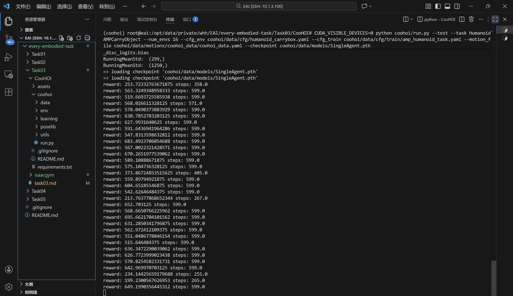
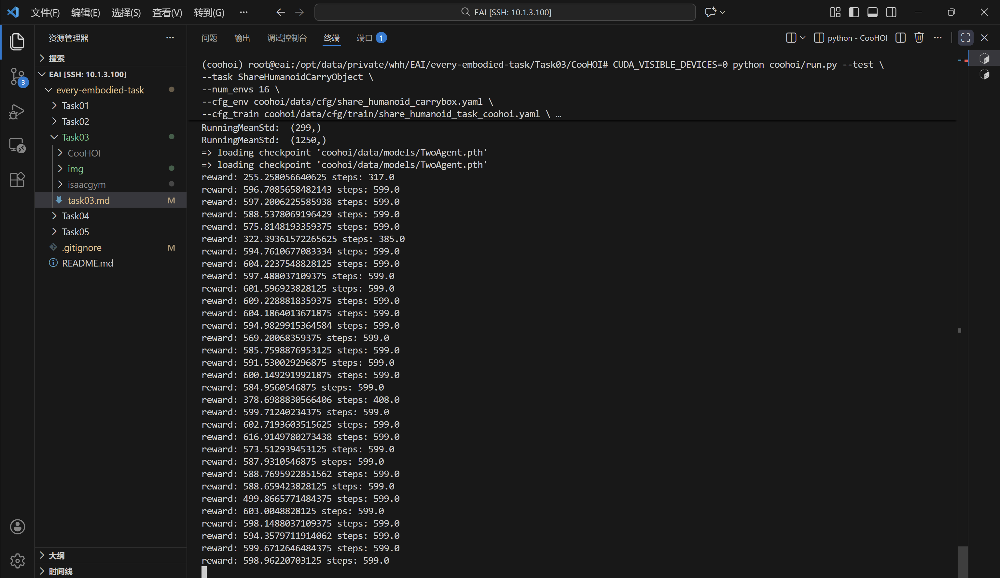
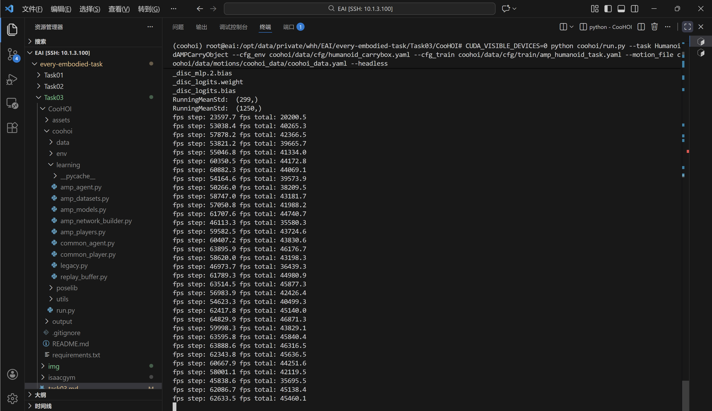
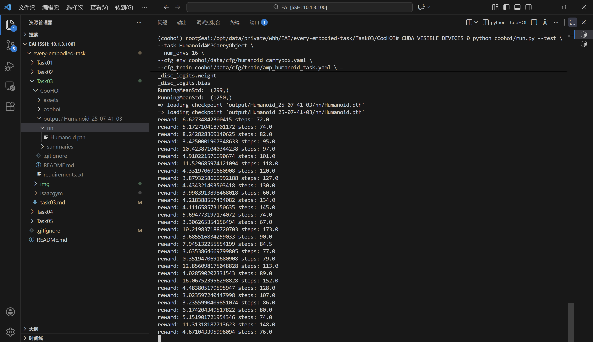
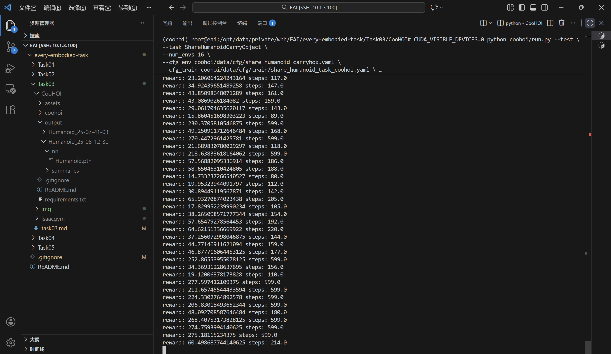

# CooHOI复现

## 环境准备

下载 Isaac Gym：

```bash
wget https://developer.nvidia.com/isaac-gym-preview-4
tar -xvzf isaac-gym-preview-4
```

创建 conda 环境：

```bash
conda create -n coohoi python=3.8
conda activate coohoi
```

安装 IsaacGym 的 Python 包装器：

```bash
pip install -e isaacgym/python
```

安装其他依赖项：

```bash
git clone https://github.com/Winston-Gu/CooHOI

# 注意要进入到CooHOI目录下安装
cd CooHOI
pip install -r requirements.txt
```

遇到报错:

>torchvision 0.19.1 requires torch==2.4.1, but you have torch 1.8.1 which is incompatible.

解决方案：

```bash
pip install torchvision==0.9.1
```

## 单智能体物体搬运任务

查看在单智能体物体搬运任务上的结果： 如果内存不足，建议num env设置为1或者4

```bash
CUDA_VISIBLE_DEVICES=0 python coohoi/run.py --test \
--task HumanoidAMPCarryObject \
--num_envs 16 \
--cfg_env coohoi/data/cfg/humanoid_carrybox.yaml \
--cfg_train coohoi/data/cfg/train/amp_humanoid_task.yaml \
--motion_file coohoi/data/motions/coohoi_data/coohoi_data.yaml \
--checkpoint coohoi/data/models/SingleAgent.pth
```

如果遇到以下错误：

>ImportError: libpython3.8m.so.1.0: cannot open shared object file: No such file or directory

设置环境变量：

```bash
# 位置可以通过 conda env list 查看
export LD_LIBRARY_PATH=/path/to/conda/envs/your_env/lib
```

如果运行出现版本不匹配，重新安装即可：

```bash
# 1. 卸载旧版 torch
pip uninstall -y torch torchvision

# 2. 安装兼容 PyTorch (建议使用 2.1.0 或更高配合 CUDA 12.1)
pip install torch==2.1.0 torchvision==0.16.0 --index-url https://download.pytorch.org/whl/cu121

# 3. 重新安装 Isaac Gym Python 绑定 (这会触发重新编译 gymtorch.so)
cd /isaacgym/python
pip install -e .
```

重新运行：



## 双智能体物体搬运任务

```bash
CUDA_VISIBLE_DEVICES=0 python coohoi/run.py --test \
--task ShareHumanoidCarryObject \
--num_envs 16 \
--cfg_env coohoi/data/cfg/share_humanoid_carrybox.yaml \
--cfg_train coohoi/data/cfg/train/share_humanoid_task_coohoi.yaml \
--motion_file coohoi/data/motions/coohoi_data/coohoi_data.yaml \
--checkpoint coohoi/data/models/TwoAgent.pth
```

运行结果：



## 单人形机器人技能训练

### 训练指令：

```bash
CUDA_VISIBLE_DEVICES=0 python coohoi/run.py \
--task HumanoidAMPCarryObject \
--cfg_env coohoi/data/cfg/humanoid_carrybox.yaml \
--cfg_train coohoi/data/cfg/train/amp_humanoid_task.yaml \
--motion_file coohoi/data/motions/coohoi_data/coohoi_data.yaml \
--headless \
--wandb_name "<experiement_name>"
```

运行结果：



### 进行评估：

在 output/Humanoid_<date>_<time>/nn 目录下找到模型权重文件（checkpoint）

```bash
CUDA_VISIBLE_DEVICES=0 python coohoi/run.py --test \
--task HumanoidAMPCarryObject \
--num_envs 16 \
--cfg_env coohoi/data/cfg/humanoid_carrybox.yaml \
--cfg_train coohoi/data/cfg/train/amp_humanoid_task.yaml \
--motion_file coohoi/data/motions/coohoi_data/coohoi_data.yaml \
--checkpoint <checkpoint_path>
```

运行结果：



## 双人形机器人协作训练

### 协作训练：

```bash
CUDA_VISIBLE_DEVICES=0 python coohoi/run.py \
--task ShareHumanoidCarryObject \
--cfg_env coohoi/data/cfg/share_humanoid_carrybox.yaml \
--cfg_train coohoi/data/cfg/train/share_humanoid_task_coohoi.yaml \
--motion_file coohoi/data/motions/coohoi_data/coohoi_data.yaml \
--headless \
--is_finetune \
--pretrain_checkpoint <ckpt_path> \
--wandb \
--wandb_name "<experiement_name>"
```

运行结果：


### 进行评估：

```bash
CUDA_VISIBLE_DEVICES=0 python coohoi/run.py --test \
--task ShareHumanoidCarryObject \
--num_envs 16 \
--cfg_env coohoi/data/cfg/share_humanoid_carrybox.yaml \
--cfg_train coohoi/data/cfg/train/share_humanoid_task_coohoi.yaml \
--motion_file coohoi/data/motions/coohoi_data/coohoi_data.yaml \
--checkpoint <ckpt_path>
```

运行结果：


